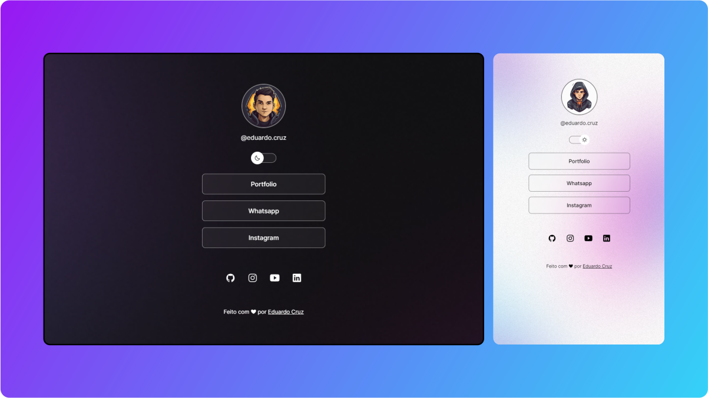

<h1 align="center">EVENTO INNEO.ORG AULA 001</h1>

Evento exclusivo e gratuito da INNEO>ORG, para ensinar programação web

  <a href="#" target="_blank">Tecnologia</a>
  <a href="#" target="_blank">Projetos</a>
  <a href="#" target="_blank">Layouts</a>

  

## Tecnologias

Projeto desenvolvido em:
-- HTML
-- CSS
-- Figma
-- javaScript
-- Git e GitHub

## memo: Licença

Esse projeto esta sob a licença MIT.

Feito com ❤ por INNEO.ORG

